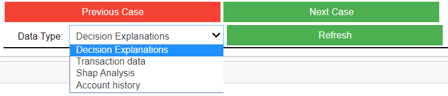

# Explainable AML Analysis: Czech Bank 

This tool is to help people in examine fraudalent cases predicted by our method. This tool is designed to let anyone explore the cases in an interactive way without any knowledge of the underlying machine learning, deep leanring models and the feature calculation techniques.

## How to run the tool:
1. [open binder](https://mybinder.org/v2/gh/abhmalik/Exoplanet-Vetting-Tool/master) and run `Demo_file.ipynb`
2. Run both the code blocks and the tools will initiate. After you successfully start the tool you should see the following buttons:

## Structure of the tool:
- Decision Explanations: Automatically generated textual explanation of top reasons for this prediction.
- Transaction data: Transaction details
- SHAP Analysis: SHAP Values breaks down a prediction to show the impact of each feature. Here you'll see top 10 features that were important for this prediction.
- 'Account history': The entire available history of the account associated with this transaction.

Our methods consists of a machine learning and a deep learning method. Deep learning method is used to make predict anomalous behavious of any account based on its history while the machine learning model is used to explain that prediction in simple words.

The client data is removed from the project and we are used [Real anonymized Czech bank data](https://data.world/lpetrocelli/czech-financial-dataset-real-anonymized-transactions) for this repository.
